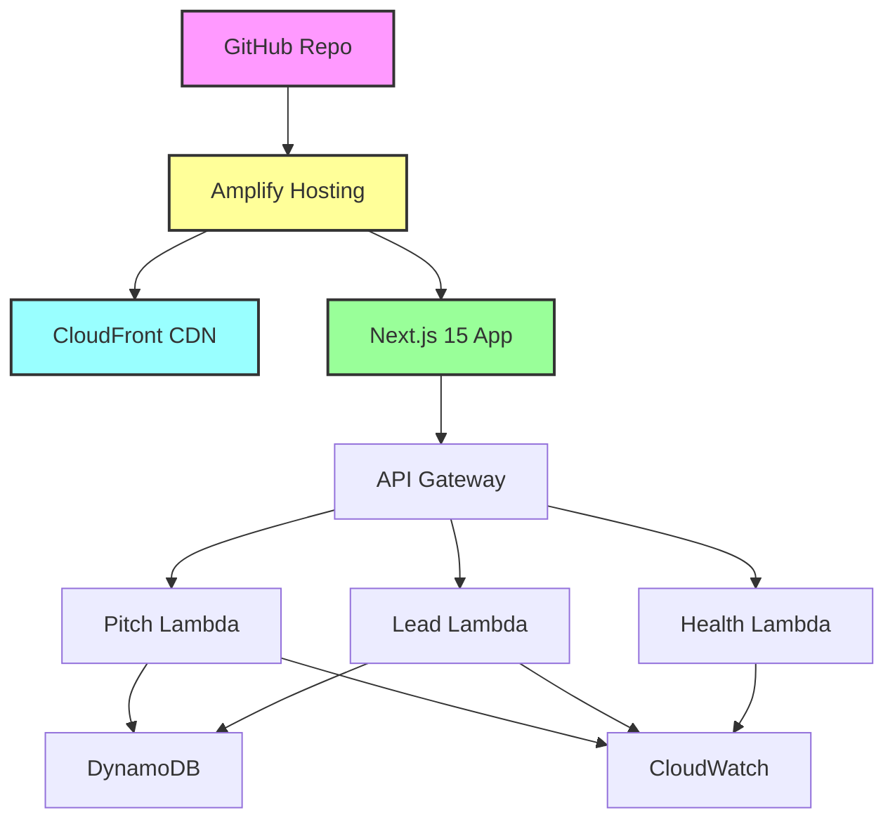

# 🚀 Marko's Personal Introduction Site

> A production-ready personal introduction website showcasing cloud automation expertise through interactive Lambda demos and modern web technologies.

[](https://nextjs.org/)
[](https://aws.amazon.com/amplify/)
[](https://www.typescriptlang.org/)
[](https://tailwindcss.com/)

**Live Demo:** [Visit Site](https://your-domain.com) | **Architecture:** Serverless | **Status:** Production Ready

## 🏗️ Architecture Overview

<details>
<summary>Click to view system architecture diagram</summary>



</details>

## ✨ Features

### 🎯 Core Functionality
- **Interactive Single-Page App** - Hero, services, live demos, and contact sections
- **AI-Powered Pitch Generator** - Tailored content based on role and focus area
- **Smart Contact Form** - Lead capture with DynamoDB storage and validation

### 🔧 Technical Excellence  
- **Real-time Analytics** - Anonymized data collection with 7-day TTL
- **Rate Limiting & Security** - Comprehensive error handling and request throttling
- **CloudWatch Monitoring** - Custom metrics and structured logging
- **Responsive Design** - TailwindCSS with smooth micro-animations
- **SEO Optimized** - Server-side rendering with proper meta tags

## 🛠️ Tech Stack

| Category | Technology | Version |
|----------|------------|---------|
| **Frontend** | Next.js (App Router) | 15.5.4 |
| **Language** | TypeScript | 5.9+ |
| **Styling** | TailwindCSS | 4.0 |
| **Backend** | AWS Lambda | Node.js 22.x |
| **Database** | DynamoDB | with TTL |
| **Hosting** | AWS Amplify | with SSR |
| **API** | AWS API Gateway | REST |
| **Monitoring** | CloudWatch | Logs & Metrics |
| **CI/CD** | Amplify CI/CD | GitHub Integration |

## 🚀 Quick Start

### Prerequisites

```bash
# Required
node --version  # 18+
npm --version   # Latest

# For AWS deployment
aws --version   # AWS CLI configured
npm install -g @aws-amplify/cli
```

### Local Development

```bash
# 1. Clone and install
git clone <repository-url>
cd marko
npm install

# 2. Start development (works out-of-the-box!)
npm run dev

# 3. Open browser
open http://localhost:3000
```

> 💡 **No environment setup required!** The app works immediately with sensible defaults.

### 📜 Available Scripts

<details>
<summary>Development Scripts</summary>

| Command | Description |
|---------|-------------|
| `npm run dev` | Start development server with Turbopack |
| `npm run build` | Build production application |
| `npm run start` | Start production server |
| `npm run lint` | Run ESLint |
| `npm run lint:fix` | Fix ESLint issues automatically |
| `npm run format` | Format code with Prettier |

</details>

<details>
<summary>Environment & Validation</summary>

| Command | Description |
|---------|-------------|
| `npm run validate:env` | Validate all environment variables |
| `npm run validate:env:frontend` | Validate frontend environment variables |
| `npm run validate:env:backend` | Validate backend environment variables |
| `npm run setup:monitoring` | Set up CloudWatch monitoring |

</details>

<details>
<summary>Testing & Performance</summary>

| Command | Description |
|---------|-------------|
| `npm run test:e2e` | Run end-to-end tests |
| `npm run perf:audit` | Performance audit |
| `npm run analyze` | Bundle analysis |

</details>

## ☁️ AWS Amplify Deployment

<details>
<summary>Initial Setup Guide</summary>

### 1. Initialize Amplify Project
```bash
amplify init
```

**Configuration:**
- Project name: `marko-personal-site`
- Environment: `dev` / `staging` / `prod`
- Framework: `react`
- Build directory: `.next`
- Build command: `npm run build`

### 2. Add Resources
```bash
# Add hosting
amplify add hosting

# Add API with Lambda functions
amplify add api

# Add DynamoDB storage
amplify add storage
```

### 3. Deploy
```bash
amplify push
```

</details>

### 🔧 Environment Configuration

> **🚀 Zero-Config Deployment!** Environment variables are automatically generated during build. No manual setup required!

<details>
<summary>Auto-Generated Variables</summary>

| Variable | Source | Example |
|----------|--------|---------|
| `STAGE` | Git branch | `dev` / `staging` / `prod` |
| `NEXT_PUBLIC_API_URL` | API Gateway | `https://api.example.com` |
| `TABLE_NAME` | DynamoDB | `personalSiteData-dev` |
| `AWS_REGION` | Amplify env | `us-east-1` |
| `RATE_LIMIT_MAX` | Stage-based | `10` (dev) / `30` (prod) |

</details>

<details>
<summary>Manual Overrides (Optional)</summary>

Only set these in Amplify Console if needed:

```bash
RATE_LIMIT_MAX=50
RATE_LIMIT_WINDOW=120
CORS_ORIGIN=https://custom-domain.com
```

</details>

### 🚀 Deployment Process

```bash
# 1. Deploy backend
amplify push

# 2. Connect to GitHub (via Amplify Console)
amplify console

# 3. Enable auto-deployment on main branch
```

**Multi-Environment Setup:**
```bash
# Development
amplify env add dev && amplify push --env dev

# Production  
amplify env add prod && amplify push --env prod
```

## 🧪 Testing

<details>
<summary>Local Testing</summary>

```bash
# Frontend
npm run dev
npm run build && npm run start

# Backend (Lambda functions)
amplify mock api

# Environment validation
npm run validate:env
```

</details>

<details>
<summary>API Testing</summary>

```bash
# Test pitch endpoint
curl -X POST http://localhost:20002/pitch \
  -H "Content-Type: application/json" \
  -d '{"role": "cto", "focus": "cloud"}'

# Test health endpoint
curl -X GET http://localhost:20002/health
```

</details>

## 📡 API Reference

<details>
<summary><code>POST /pitch</code> - Generate tailored pitch</summary>

**Request:**
```json
{
  "role": "recruiter" | "cto" | "product" | "founder",
  "focus": "ai" | "cloud" | "automation"
}
```

**Response:**
```json
{
  "pitch": "Generated pitch text...",
  "confidence": 0.95,
  "timestamp": "2024-01-15T10:30:00Z",
  "requestId": "uuid-string"
}
```

</details>

<details>
<summary><code>POST /lead</code> - Capture contact form</summary>

**Request:**
```json
{
  "name": "John Doe",
  "email": "john@example.com", 
  "message": "Interested in collaboration..."
}
```

**Response:**
```json
{
  "ok": true,
  "message": "Lead captured successfully"
}
```

</details>

<details>
<summary><code>GET /health</code> - System health check</summary>

**Response:**
```json
{
  "ok": true,
  "env": "dev",
  "version": "1.0.0",
  "timestamp": "2024-01-15T10:30:00Z",
  "uptime": 3600
}
```

</details>

## 📊 Monitoring & Observability

<details>
<summary>CloudWatch Metrics</summary>

| Metric | Description |
|--------|-------------|
| `PitchRequests` | Count of pitch generation requests |
| `PitchLatency` | Response time for pitch generation |
| `LeadCaptures` | Count of lead form submissions |
| `ErrorRate` | Percentage of failed requests |

</details>

<details>
<summary>Logging</summary>

- **Structured JSON logging** with correlation IDs
- **Separate log groups** per Lambda function  
- **30-day retention** for cost optimization

```bash
# Setup monitoring
npm run setup:monitoring:dev    # Development
npm run setup:monitoring:prod   # Production
```

</details>

## 🔧 Troubleshooting

<details>
<summary>Common Issues & Solutions</summary>

### Environment Variables Not Loading
```bash
# Check configuration
npm run validate:env

# Verify .env.local exists
ls -la .env.local
```

### Lambda Functions Not Deploying
```bash
# Check Amplify CLI version
amplify --version

# Verify AWS credentials
aws sts get-caller-identity

# Review CloudFormation stack
amplify console
```

### CORS Errors
- Verify `CORS_ORIGIN` matches your domain
- Check API Gateway CORS in AWS Console
- Ensure proper headers in Lambda responses

### DynamoDB Access Issues
- Verify IAM roles have DynamoDB permissions
- Check `TABLE_NAME` environment variable
- Review CloudWatch logs for errors

</details>

<details>
<summary>Debug Commands</summary>

```bash
amplify status              # Check Amplify status
amplify console            # View Amplify logs
npm run validate:env       # Check environment variables
curl -X GET https://your-api-url/health  # Test API
```

</details>

## 🤝 Contributing

```bash
# 1. Fork & clone
git checkout -b feature-name

# 2. Make changes & test
npm run lint:fix && npm run format

# 3. Commit & push
git commit -m 'Add feature'
git push origin feature-name

# 4. Submit pull request
```

## 📄 License

This project is private and proprietary.

## 💬 Support

- 📖 Check [troubleshooting section](#-troubleshooting)
- 📊 Review CloudWatch logs for errors
- 💌 Contact development team for support

---

<div align="center">

**Built with ❤️ using Next.js 15 and AWS Amplify**

[⬆ Back to top](#-markos-personal-introduction-site)

</div>
